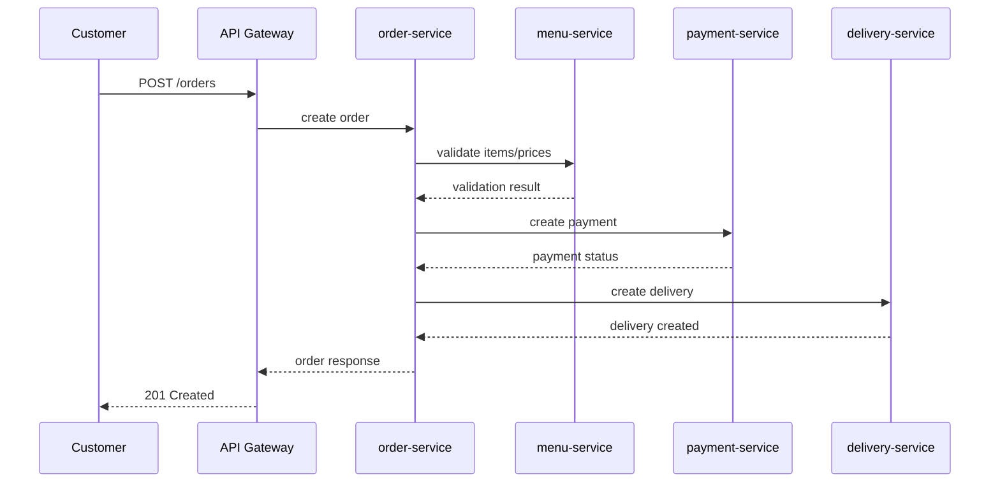

# Microservices System - Analysis and Design

This document describes service-oriented analysis and design for the **Food Ordering System**.

**References:**
1. Service-Oriented Architecture: Analysis and Design for Services and Microservices - Thomas Erl (2nd Edition)
2. Microservices Patterns - Chris Richardson
3. Assignment handout - Service-Oriented Software Development

---

## 1. Problem Statement

- Domain: Food ordering and delivery.
- Problem:
  - Customers need a simple way to browse restaurants, order food, pay, and track delivery.
  - Restaurants need a manageable workflow for menu and order confirmation.
  - Delivery flow needs clear status updates for customers.
- Users/Actors:
  - Customer
  - Restaurant staff/owner
  - Delivery staff
  - System admin (optional for MVP)
- Scope:
  - In scope (MVP): menu browsing, order creation, payment status, delivery status, order tracking.
  - Out of scope: promotions engine, real online payment gateway integration, recommendation system.

---

## 2. Service-Oriented Analysis

### 2.1 Business Process Decomposition

| Step | Activity | Actor | Description |
|---|---|---|---|
| 1 | Browse restaurants and menus | Customer | Customer views available restaurants and menu items. |
| 2 | Create order | Customer | Customer selects items and submits order request. |
| 3 | Validate order | System | Order service validates item availability and prices. |
| 4 | Process payment | Customer/System | Payment service creates payment and returns payment result. |
| 5 | Confirm order | Restaurant | Restaurant confirms or rejects order. |
| 6 | Create delivery task | System | Delivery service creates delivery request for confirmed order. |
| 7 | Update delivery status | Delivery staff/System | Delivery status moves from assigned to delivered. |
| 8 | Complete order | System | Order marked completed after delivery success. |

### 2.2 Entity Identification

| Entity | Key Attributes | Owned By |
|---|---|---|
| Customer | id, full_name, phone, email, default_address | customer-service |
| Address | id, customer_id, line1, ward, district, city | customer-service |
| Restaurant | id, name, phone, open_status, rating | restaurant-service |
| MenuItem | id, restaurant_id, name, price, availability, category | menu-service |
| Order | id, customer_id, restaurant_id, total_amount, status, created_at | order-service |
| OrderItem | id, order_id, menu_item_id, quantity, unit_price, subtotal | order-service |
| Payment | id, order_id, method, amount, status, transaction_ref | payment-service |
| Delivery | id, order_id, shipper_name, phone, status, eta | delivery-service |

### 2.3 Service Candidate Identification

Service candidates by business capability and bounded context:

- customer-service: customer profile and address management.
- restaurant-service: restaurant info and operating status.
- menu-service: menu data and item availability.
- order-service: order lifecycle and order items.
- payment-service: payment creation and status management.
- delivery-service: delivery assignment and tracking.
- api-gateway: single entry point for frontend clients.

---

## 3. Service-Oriented Design

### 3.1 Service Inventory

| Service | Responsibility | Type |
|---|---|---|
| customer-service | Manage customer profile and addresses | Entity service |
| restaurant-service | Manage restaurant profile and availability | Entity service |
| menu-service | Manage menu catalog and item states | Entity service |
| order-service | Orchestrate order lifecycle | Task service |
| payment-service | Handle payment records and status transitions | Task service |
| delivery-service | Handle delivery tasks and tracking | Task service |
| api-gateway | Routing, auth, and API entry point | Utility service |

### 3.2 Service Capabilities (Interface Draft)

**customer-service**

| Capability | Method | Endpoint | Input | Output |
|---|---|---|---|---|
| Get profile | GET | `/customers/{id}` | path id | Customer |
| Create address | POST | `/customers/{id}/addresses` | AddressCreate | Address |

**restaurant-service**

| Capability | Method | Endpoint | Input | Output |
|---|---|---|---|---|
| List restaurants | GET | `/restaurants` | query filters | Restaurant[] |
| Update open status | PATCH | `/restaurants/{id}/status` | status | Restaurant |

**menu-service**

| Capability | Method | Endpoint | Input | Output |
|---|---|---|---|---|
| List menu by restaurant | GET | `/restaurants/{id}/menu-items` | path id | MenuItem[] |
| Validate menu items | POST | `/menu-items/validate` | items[] | validation result |

**order-service**

| Capability | Method | Endpoint | Input | Output |
|---|---|---|---|---|
| Create order | POST | `/orders` | OrderCreate | Order |
| Get order detail | GET | `/orders/{id}` | path id | OrderDetail |
| Update order status | PATCH | `/orders/{id}/status` | status | Order |

**payment-service**

| Capability | Method | Endpoint | Input | Output |
|---|---|---|---|---|
| Create payment | POST | `/payments` | PaymentCreate | Payment |
| Confirm payment | PATCH | `/payments/{id}/confirm` | confirm payload | Payment |

**delivery-service**

| Capability | Method | Endpoint | Input | Output |
|---|---|---|---|---|
| Create delivery | POST | `/deliveries` | DeliveryCreate | Delivery |
| Update delivery status | PATCH | `/deliveries/{id}/status` | status | Delivery |

### 3.3 Service Interactions

### 3.4 Data Ownership and Boundaries

| Data Entity | Owner Service | Access Pattern |
|---|---|---|
| Customer, Address | customer-service | CRUD via REST |
| Restaurant | restaurant-service | CRUD via REST |
| MenuItem | menu-service | CRUD + validation API |
| Order, OrderItem | order-service | CRUD + orchestration |
| Payment | payment-service | Create/update status via REST |
| Delivery | delivery-service | Create/update status via REST |

---

## 4. API Specifications

Planned API specs:

- `docs/api-specs/customer-service.yaml`
- `docs/api-specs/restaurant-service.yaml`
- `docs/api-specs/menu-service.yaml`
- `docs/api-specs/order-service.yaml`
- `docs/api-specs/payment-service.yaml`
- `docs/api-specs/delivery-service.yaml`

(Current template files `service-a.yaml` and `service-b.yaml` will be replaced in Phase 2.)

---

## 5. Data Model (Logical)

### customer-service

- Customer(id, full_name, email, phone, created_at)
- Address(id, customer_id, line1, ward, district, city, is_default)

### restaurant-service

- Restaurant(id, name, phone, open_status, created_at)

### menu-service

- MenuItem(id, restaurant_id, name, category, price, availability, updated_at)

### order-service

- Order(id, customer_id, restaurant_id, total_amount, status, payment_status, delivery_status, created_at)
- OrderItem(id, order_id, menu_item_id, item_name, unit_price, quantity, subtotal)

### payment-service

- Payment(id, order_id, method, amount, status, transaction_ref, paid_at)

### delivery-service

- Delivery(id, order_id, shipper_name, shipper_phone, status, eta, delivered_at)

---

## 6. Non-Functional Requirements

| Requirement | Description |
|---|---|
| Performance | Average API response < 300ms for read APIs under normal load |
| Scalability | Scale `menu-service` and `order-service` independently |
| Availability | Core ordering flow remains available even if non-core service is degraded |
| Security | JWT at gateway, input validation, role-based access for restaurant actions |
| Observability | Structured logs and request IDs across gateway and services |
| Maintainability | Separate repo modules/folders and database per service |

---

## 7. Team Split (3 Members)

- Member 1: `customer-service` + `order-service` analysis and API draft.
- Member 2: `restaurant-service` + `menu-service` analysis and API draft.
- Member 3: `payment-service` + `delivery-service` + gateway integration flow and failure handling design.
