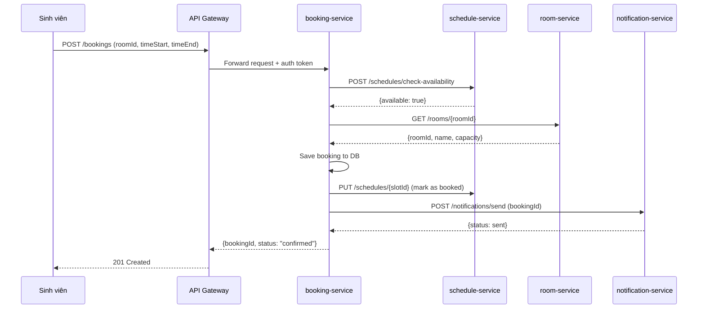
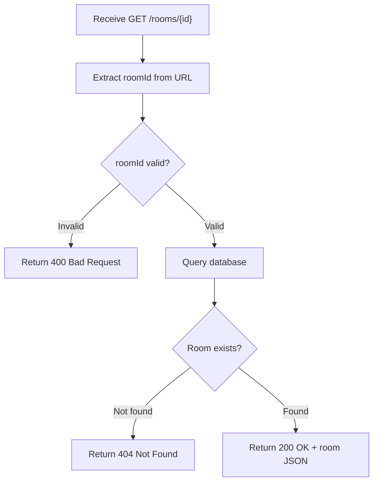
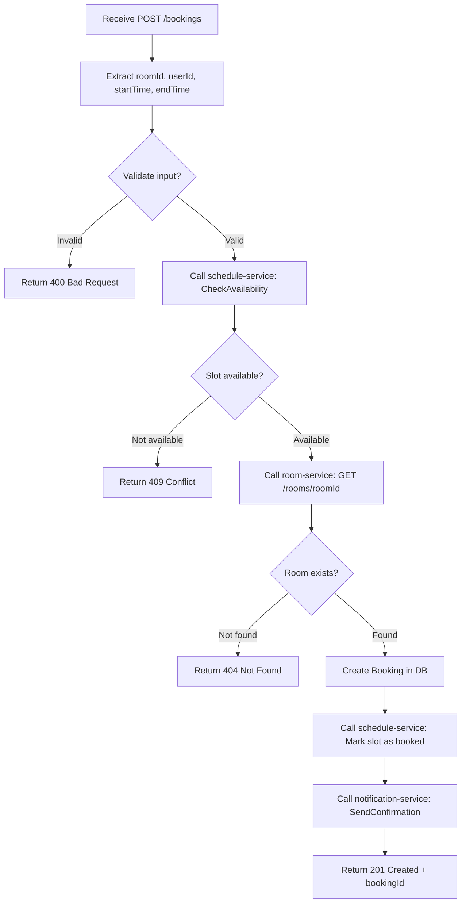
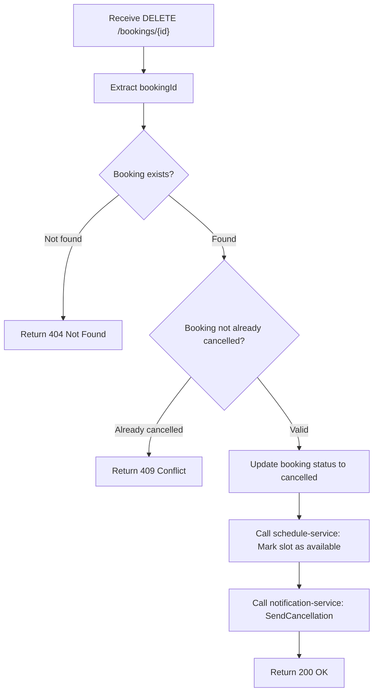
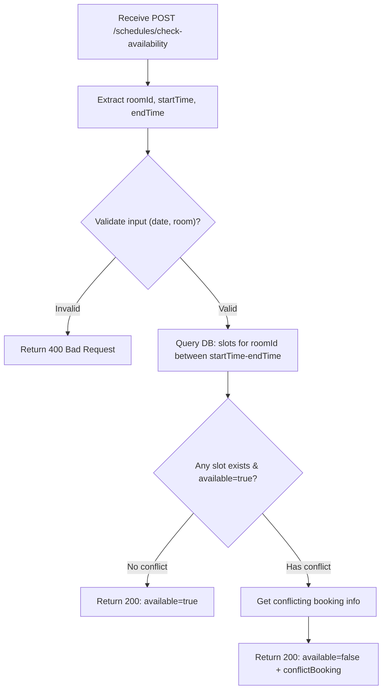
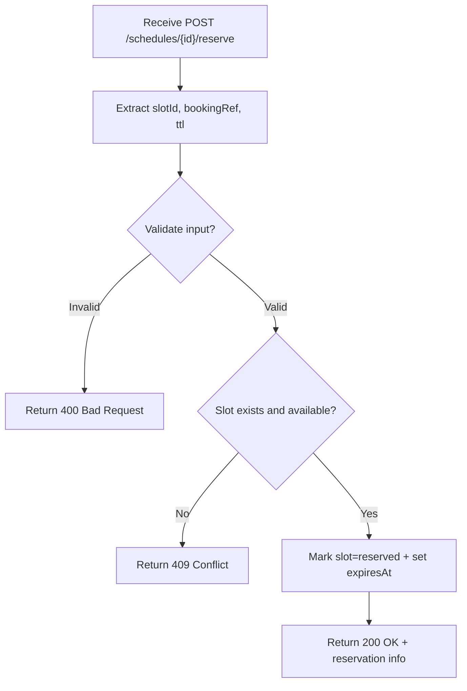
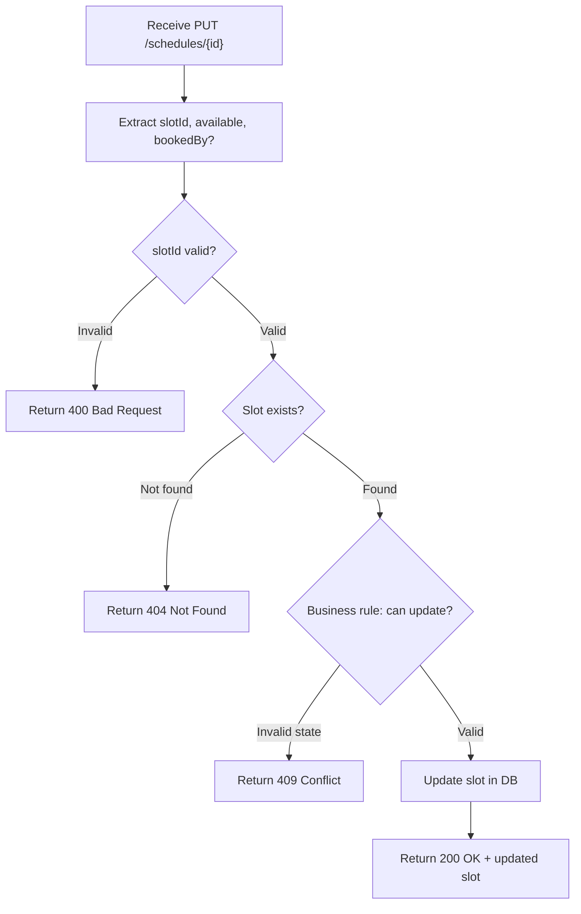

# Analysis and Design — Step-by-Step Action Approach

> **Goal**: Analyze a specific business process and design a service-oriented automation solution (SOA/Microservices).
> **Scope**: 4–6 week assignment — focus on **one business process**, not an entire system.
>
> **Alternative to**: [`analysis-and-design-ddd.md`](analysis-and-design-ddd.md) (Domain-Driven Design approach).
> Choose **one** approach, not both. Use this if your team prefers discovering service boundaries through **decomposing concrete actions** rather than domain modeling.

**References:**
1. *Service-Oriented Architecture: Analysis and Design for Services and Microservices* — Thomas Erl (2nd Edition)
2. *Microservices Patterns: With Examples in Java* — Chris Richardson
3. *Bài tập — Phát triển phần mềm hướng dịch vụ* — Hung Dang (available in Vietnamese)

---

### How Step-by-Step Action differs from DDD

| | Step-by-Step Action (this document) | DDD |
|---|---|---|
| **Thinking direction** | Bottom-up: actions → group → service | Dual: top-down framing + bottom-up Event Storming |
| **Service boundary decided by** | Similarity of actions/functions | Semantic boundary of business domain |
| **Best suited for** | Small–medium systems, clearer technical scope | Complex business logic, multiple subdomains |
| **Key risk** | Services may be fragmented by technical logic | Requires deep domain understanding upfront |

Both approaches lead to a list of services with clear responsibilities. This approach is more structured and mechanical — useful when your team understands *what the system does* better than *what the business domain is*.

### Progression Overview

| Step | What you do | Output |
|------|------------|--------|
| **1.1** | Define the Business Process | Process diagram, actors, scope |
| **1.2** | Survey existing systems | System inventory |
| **1.3** | State non-functional requirements | NFR table |
| **2.1–2.2** | Decompose process & filter unsuitable actions | Filtered action list |
| **2.3** | Group reusable actions → Entity Service Candidates | Entity service table |
| **2.4** | Group process-specific actions → Task Service Candidate | Task service table |
| **2.5** | Map entities to REST Resources | Resource URI table |
| **2.6** | Associate capabilities with resources and HTTP methods | **Service capabilities → API endpoints** |
| **2.7** | Identify cross-cutting / high-autonomy candidates | Utility / Microservice Candidates |
| **2.8** | Show how services collaborate | Service composition diagram |
| **3.1** | Specify service contracts | OpenAPI endpoint tables |
| **3.2** | Design internal service logic | Flowchart per service |

---

## Part 1 — Analysis Preparation

### 1.1 Business Process Definition

Describe the **one** business process your team will automate. Keep scope realistic for 4–6 weeks.

- **Domain**: Hệ thống quản lý phòng học và đặt phòng tại trường đại học
- **Business Process**: "Sinh viên đặt phòng học cho các hoạt động nhóm hoặc học tập"
- **Actors**: 
  - Sinh viên (Student)
  - Người quản lý phòng học (Room Manager)
  - Hệ thống lịch trình (Scheduler)
- **Scope**: Từ khi sinh viên muốn đặt phòng → lựa chọn phòng khả dụng → xác nhận đặt phòng. Không bao gồm: thanh toán, tính phí sử dụng.

**Process Diagram:**

```
[Sinh viên] → [Xem danh sách phòng] → [Chọn phòng & thời gian] → [Kiểm tra khả dụng] → [Xác nhận đặt phòng] → [Lưu thông tin đặt phòng]
```

> **Quy trình chi tiết:**
> 1. Sinh viên đăng nhập vào hệ thống
> 2. Xem danh sách phòng học khả dụng
> 3. Chọn phòng và khung thời gian muốn đặt
> 4. Hệ thống kiểm tra xem slot đó có trống không
> 5. Nếu trống → tạo đơn đặt phòng → ghi nhận thông tin
> 6. Gửi xác nhận cho sinh viên

### 1.2 Existing Automation Systems

List existing systems, databases, or legacy logic related to this process.

| Hệ thống | Loại | Vai trò hiện tại | Phương thức tương tác |
|---------|------|-----------------|---------------------|
| Google Sheets (Danh sách phòng) | Spreadsheet | Quản lý phòng học thủ công | Truy cập trực tiếp |
| Email | Manual | Ghi nhận yêu cầu đặt phòng | Gửi email xác nhận |

> Hiện tại, hệ thống đặt phòng được thực hiện **bán tự động**: danh sách phòng lưu trữ trên Google Sheets, sinh viên gửi email hoặc ghi danh sách yêu cầu, người quản lý kiểm tra thủ công xem slot có trống không rồi gửi xác nhận.

### 1.3 Non-Functional Requirements

Non-functional requirements serve as input in two places:
- **2.7** — justifying Utility Service and Microservice Candidates
- **`docs/architecture.md` Section 1** — justifying architectural pattern choices (e.g., high availability → Circuit Breaker, scalability → Database per Service)

| Yêu cầu | Mô tả |
|--------|--------|
| **Performance** | Phản hồi tìm kiếm danh sách phòng khả dụng phải < 2 giây. Xác nhận đặt phòng phải < 1 giây. Xử lý được ≥ 100 yêu cầu/giây |
| **Security** | Sinh viên chỉ xem được thông tin phòng công khai. Chỉ người quản lý mới có quyền tạo/sửa/xóa thông tin phòng. Xác thực qua JWT token |
| **Scalability** | Hệ thống phải chịu được ≥ 1000 sinh viên truy cập đồng thời vào khoảng 13:00 (giờ cao điểm). Schedule Service phải có thể xử lý được nhiều slot cùng lúc |
| **Availability** | Uptime ≥ 99%. Nếu một service bị lỗi, các service khác vẫn hoạt động được (ví dụ: Room Service lỗi thì vẫn có thể xem Booking cũ) |

---

## Part 2 — REST/Microservices Modeling

### 2.1 Decompose Business Process & 2.2 Filter Unsuitable Actions

Decompose the process from 1.1 into granular actions. Mark actions unsuitable for service encapsulation.

> 💡 **How to do it:** Walk through your process diagram step by step. For each step, write one or more actions the system needs to perform. Then ask: *"Can this action be encapsulated as a reusable service call?"* If it requires irreducible human judgment or is a one-time manual task, mark it ❌.

| # | Hành động | Actor | Mô tả | Phù hợp? |
|---|----------|-------|------|----------|
| 1 | ListRooms | Sinh viên | Lấy danh sách các phòng học trong hệ thống | ✅ |
| 2 | GetRoomDetails | Sinh viên | Xem chi tiết phòng (sức chứa, thiết bị, vị trí) | ✅ |
| 3 | CheckAvailability | Hệ thống | Kiểm tra slot thời gian có khả dụng hay không | ✅ |
| 4 | CreateBooking | Sinh viên | Tạo đơn đặt phòng mới | ✅ |
| 5 | GetBooking | Sinh viên | Xem chi tiết đơn đặt phòng đã tạo | ✅ |
| 6 | CancelBooking | Sinh viên | Hủy đơn đặt phòng | ✅ |
| 7 | UpdateRoom | Người quản lý | Cập nhật thông tin phòng (số chỗ, thiết bị) | ✅ |
| 8 | DeleteRoom | Người quản lý | Xóa phòng khỏi hệ thống | ✅ |
| 9 | CreateScheduleSlot | Người quản lý | Tạo slot thời gian mở cho đặt phòng | ✅ |
| 10 | ApproveBooking | Người quản lý | Người quản lý phòng quyết định có chấp nhận hay không | ❌ |
| 11 | SendNotification | Hệ thống | Gửi email/SMS xác nhận tới sinh viên | ✅ |
| 12 | UpdateScheduleSlot | Người quản lý | Cập nhật trạng thái slot (mở/đóng) | ✅ |

> **Lý do từ chối:**
> - #10 (ApproveBooking): Yêu cầu quyết định của con người. Trong phạm vi bài tập này, ta sẽ auto-accept nếu slot trống.

### 2.3 Entity Service Candidates

Identify business entities and group reusable (agnostic) actions into Entity Service Candidates.

> 💡 **How to do it:** Look at the ✅ actions from 2.1–2.2. Ask: *"Which business entity does this action primarily read or modify?"* Actions that operate on the same entity are grouped together. Each group becomes an **Entity Service Candidate**.
>
> An action is **agnostic** (entity-level) if it is potentially reusable across multiple business processes — e.g., "GetCustomer" could be called from order, support, and billing processes.

| Đối tượng | Service Candidate | Hành động Agnostic |
|-----------|-------------------|-------------------|
| Phòng học (Room) | room-service | ListRooms, GetRoomDetails, UpdateRoom, DeleteRoom |
| Lịch trình/Slot (Schedule) | schedule-service | CreateScheduleSlot, UpdateScheduleSlot, CheckAvailability |
| Đặt phòng (Booking) | booking-service | CreateBooking, GetBooking, CancelBooking |

> **Giải thích:**
> - **room-service**: Quản lý thông tin cơ bản về các phòng (tên, sức chứa, thiết bị, vị trí). Được tái sử dụng bởi bất kỳ service nào cần thông tin phòng.
> - **schedule-service**: Quản lý các slot thời gian sẵn dùng cho từng phòng. CheckAvailability là hành động tái sử dụng giúp kiểm tra slot.
> - **booking-service**: Lưu trữ các đơn đặt phòng của sinh viên. Là task service chính nhưng cũng có hành động agnostic để query booking.

### 2.4 Task Service Candidate

Group process-specific (non-agnostic) actions into a Task Service Candidate.

> 💡 **How to do it:** From the ✅ actions in 2.1–2.2, find the ones that are **specific to this business process** and orchestrate multiple entities — they are not reusable on their own. These belong in a Task Service, which acts as the process orchestrator.

| Hành động Đặc Thù | Task Service Candidate |
|------------------|------------------------|
| Đặt phòng (CreateBooking) — gọi schedule-service kiểm tra khả dụng → giữ slot → lưu booking | booking-service (Orchestrator) |
| Hủy đặt phòng (CancelBooking) — cập nhật booking → giải phóng slot | booking-service (Orchestrator) |

> **Giải thích:**
> - booking-service vừa là Entity Service (lưu đơn đặt phòng) vừa là Task Service (điều phối quy trình đặt phòng).
> - Khi sinh viên CreateBooking:
>   1. booking-service nhận yêu cầu
>   2. Gọi schedule-service → CheckAvailability (slot có trống?)
>   3. Nếu trống → yêu cầu schedule-service giữ slot
>   4. Lưu Booking + cập nhật trạng thái
>   5. Trả kết quả cho client
>
> **SOA note:** booking-service đóng vai trò **process service** (orchestration), còn room-service và schedule-service là **entity services**.

### 2.5 Identify Resources

Map entities/processes to REST URI Resources.

> 💡 **How to do it:** For each Entity Service from 2.3, define the primary REST resource URI. Resources are plural nouns, not verbs. The URI represents a collection or a single item in that collection.

| Đối tượng / Quy trình | Resource URI |
|------|--------------|
| Phòng học | /rooms, /rooms/{id} |
| Lịch trình / Slot | /schedules, /schedules/{id}, /rooms/{id}/schedules |
| Đặt phòng | /bookings, /bookings/{id}, /users/{userId}/bookings |

> **Chi tiết:**
> - `/rooms`: Danh sách tất cả phòng
> - `/rooms/{id}`: Chi tiết một phòng cụ thể
> - `/schedules`: Danh sách tất cả slot
> - `/rooms/{id}/schedules`: Danh sách slot của một phòng cụ thể
> - `/bookings`: Danh sách tất cả đặt phòng
> - `/bookings/{id}`: Chi tiết một đơn đặt phòng
> - `/users/{userId}/bookings`: Danh sách đơn đặt phòng của một sinh viên

### 2.6 Associate Capabilities with Resources and Methods

> 💡 **How to do it:** For each service capability (action from 2.3–2.4), map it to a resource URI from 2.5 and the appropriate HTTP method. This table directly produces your API endpoint list for Part 3.

| Service Candidate | Hành động | Resource | HTTP Method |
|-------------------|----------|----------|-------------|
| room-service | ListRooms | /rooms | GET |
| room-service | GetRoomDetails | /rooms/{id} | GET |
| room-service | CreateRoom | /rooms | POST |
| room-service | UpdateRoom | /rooms/{id} | PUT |
| room-service | DeleteRoom | /rooms/{id} | DELETE |
| schedule-service | CreateScheduleSlot | /schedules | POST |
| schedule-service | UpdateScheduleSlot | /schedules/{id} | PUT |
| schedule-service | CheckAvailability | /schedules/check-availability | POST |
| schedule-service | GetSchedulesByRoom | /rooms/{roomId}/schedules | GET |
| schedule-service | ReserveSlot | /schedules/{id}/reserve | POST |
| schedule-service | ReleaseSlot | /schedules/{id}/release | POST |
| booking-service | CreateBooking | /bookings | POST |
| booking-service | GetBooking | /bookings/{id} | GET |
| booking-service | CancelBooking | /bookings/{id} | DELETE |
| booking-service | ListUserBookings | /users/{userId}/bookings | GET |

> **Ràng buộc:**
> - POST dùng để tạo resource mới (CreateBooking, CreateScheduleSlot)
> - GET dùng để truy vấn dữ liệu (ListRooms, GetBooking)
> - PUT dùng để cập nhật resource hiện tại (UpdateRoom, UpdateScheduleSlot)
> - DELETE dùng để xóa resource (DeleteRoom, CancelBooking)
> - Các thao tác điều phối trạng thái nghiệp vụ (giữ slot, giải phóng slot) dùng action endpoint rõ nghĩa để tránh mơ hồ ngữ nghĩa.

### 2.7 Utility Service & Microservice Candidates

Based on Non-Functional Requirements (1.3) and Processing Requirements, identify cross-cutting utility logic or logic requiring high autonomy/performance.

> 💡 **How to do it:** Look at your NFRs from 1.3. Ask:
> - *"Is there a concern (e.g., authentication, logging, notifications) that appears across multiple services?"* → **Utility Service**
> - *"Is there a capability that must scale independently or tolerate failure in isolation?"* → **Microservice Candidate** (extract from Entity/Task service)

| Candidate | Loại | Lý do (liên kết tới NFR hoặc yêu cầu xử lý) |
|-----------|------|------|
| auth-service | Utility | NFR Security: Xác thực JWT token tập trung tại Gateway, giảm lặp logic auth trong các domain service |
| notification-service | Utility | NFR Availability: Tách gửi thông báo khỏi luồng đồng bộ đặt phòng để không làm chậm phản hồi người dùng |
| schedule-service | Microservice | NFR Scalability + Performance: Yêu cầu CheckAvailability xử lý ~100 req/s vào giờ cao điểm. Để độc lập tránh ảnh hưởng từ room-service hoặc booking-service |
| room-service | Microservice | NFR Availability: Nếu room-service bị lỗi, booking-service vẫn có thể xem các booking cũ (cache thông tin phòng). Database riêng cho độc lập |

> **Giải thích:**
> - **auth-service**: xử lý tập trung concern dùng chung (cross-cutting concern)
> - **notification-service**: nên xử lý bất đồng bộ qua message/event để tăng loose coupling
> - **schedule-service & room-service**: tách riêng để bảo đảm autonomy và khả năng scale độc lập

### 2.9 SOA Principles Compliance

| Nguyên lý SOA | Áp dụng trong thiết kế |
|---------------|-------------------------|
| Standardized Service Contract | Mỗi service có endpoint rõ ràng, schema request/response thống nhất, có `GET /health` |
| Service Loose Coupling | booking-service chỉ gọi contract của room/schedule, không truy cập DB chéo |
| Service Abstraction | Client không biết logic nội bộ kiểm tra slot hay lưu booking |
| Service Reusability | room-service và schedule-service có thể tái sử dụng cho use case khác (mượn phòng họp, thi online...) |
| Service Autonomy | Mỗi service quản lý dữ liệu và vòng đời triển khai riêng |
| Service Statelessness | Request chứa đủ ngữ cảnh xử lý; trạng thái nghiệp vụ lưu ở DB |
| Service Discoverability | API được mô tả trong OpenAPI, endpoint đặt tên theo resource rõ nghĩa |
| Service Composability | booking-service compose room-service + schedule-service để hoàn tất quy trình đặt phòng |

### 2.8 Service Composition Candidates

Interaction diagram showing how Service Candidates collaborate to fulfill the business process.

> 💡 **How to do it:** Walk through the business process from 1.1 again. For each step, identify which service handles it and what inter-service calls are made. The Task Service (2.4) is typically the orchestrator in the center of the diagram.

**Quy trình chính: Sinh viên đặt phòng**



> **Các quy trình khác:**
> 1. **Xem danh sách phòng**: Client → room-service (GET /rooms)
> 2. **Hủy đặt phòng**: Client → booking-service → schedule-service → notification-service
> 3. **Cập nhật phòng**: Quản lý → room-service (PUT /rooms/{id})

---

## Part 3 — Service-Oriented Design

> Part 3 is the **convergence point** — regardless of whether you used Step-by-Step Action or DDD in Part 2, the outputs here are the same: service contracts and service logic.

### 3.1 Uniform Contract Design

Service Contract specification for each service. Full OpenAPI specs:
- [`docs/api-specs/service-a.yaml`](api-specs/service-a.yaml) — room-service
- [`docs/api-specs/service-b.yaml`](api-specs/service-b.yaml) — schedule-service + booking-service (tách theo tag)

> 💡 **Derive from 2.6:** Each row in the capability table (2.6) maps directly to one API endpoint here. The Service Candidate column tells you which service owns it.

**Service A — room-service (Quản lý thông tin phòng):**

| Endpoint | Phương thức | Mô tả | Request Body | Response (200/201) |
|----------|-----------|--------|--------------|-------------------|
| /rooms | GET | Lấy danh sách tất cả phòng | ❌ | `{rooms: [{id, name, capacity, location, ...}]}` |
| /rooms | POST | Tạo phòng mới (quản lý) | `{name, capacity, location, equipment}` | `{id, name, capacity, ...}` |
| /rooms/{id} | GET | Lấy chi tiết phòng | ❌ | `{id, name, capacity, location, equipment}` |
| /rooms/{id} | PUT | Cập nhật phòng | `{name?, capacity?, location?, equipment?}` | `{id, name, ...}` |
| /rooms/{id} | DELETE | Xóa phòng | ❌ | `{message: "deleted"}` |
| /health | GET | Health check | ❌ | `{status: "ok"}` |

**Service B — booking-service (Quản lý đặt phòng):**

| Endpoint | Phương thức | Mô tả | Request Body | Response (200/201) |
|----------|-----------|--------|--------------|-------------------|
| /bookings | GET | Lấy danh sách booking (filter by user) | ❌ | `{bookings: [{id, roomId, userId, startTime, ...}]}` |
| /bookings | POST | Tạo đơn đặt phòng mới | `{roomId, userId, startTime, endTime}` | `{id, status: "confirmed", bookingId, ...}` |
| /bookings/{id} | GET | Lấy chi tiết booking | ❌ | `{id, roomId, userId, startTime, endTime, status}` |
| /bookings/{id} | DELETE | Hủy booking | ❌ | `{message: "cancelled"}` |
| /users/{userId}/bookings | GET | Lấy danh sách booking của sinh viên | ❌ | `{bookings: [{...}]}` |
| /health | GET | Health check | ❌ | `{status: "ok"}` |

**Service C — schedule-service (Quản lý lịch trình & kiểm tra khả dụng):**

| Endpoint | Phương thức | Mô tả | Request Body | Response (200/201) |
|----------|-----------|--------|--------------|-------------------|
| /schedules | GET | Lấy danh sách tất cả slot | ❌ | `{schedules: [{id, roomId, startTime, endTime, available}]}` |
| /schedules | POST | Tạo slot thời gian mới | `{roomId, startTime, endTime}` | `{id, roomId, startTime, endTime, available: true}` |
| /schedules/{id} | GET | Lấy chi tiết slot | ❌ | `{id, roomId, startTime, endTime, available, bookedBy}` |
| /schedules/{id} | PUT | Cập nhật trạng thái slot | `{available?, bookedBy?, status?}` | `{id, ...}` |
| /schedules/{id} | DELETE | Xóa slot | ❌ | `{message: "deleted"}` |
| /schedules/check-availability | POST | Kiểm tra slot có khả dụng | `{roomId, startTime, endTime}` | `{available: true/false, slotId?, conflictBooking?}` |
| /schedules/{id}/reserve | POST | Giữ slot tạm thời cho giao dịch đặt phòng | `{bookingRef, ttlSeconds}` | `{slotId, status: "reserved", expiresAt}` |
| /schedules/{id}/release | POST | Giải phóng slot khi hủy/thất bại giao dịch | `{bookingRef}` | `{slotId, status: "available"}` |
| /rooms/{roomId}/schedules | GET | Lấy tất cả slot của một phòng | ❌ | `{schedules: [{id, startTime, endTime, available}]}` |
| /health | GET | Health check | ❌ | `{status: "ok"}` |

> 💡 **Tiếp theo:** Update file OpenAPI YAML tương ứng (`service-a.yaml`, `service-b.yaml`, `service-c.yaml` hoặc tích hợp schedule endpoints vào `service-b.yaml`) để khớp với các table này.

### 3.2 Service Logic Design

Internal processing flow for each service.

> 💡 **How to do it:** For each service, pick its most important endpoint and draw the internal logic. Focus on: input validation → business rule checks → persistence/external calls → response.

**Service A — room-service (GET /rooms/{id}):**



**Service B — booking-service (POST /bookings - Đặt phòng):**



**Service B — booking-service (DELETE /bookings/{id} - Hủy phòng):**



**Service C — schedule-service (POST /schedules/check-availability - Kiểm tra khả dụng):**



**Service C — schedule-service (POST /schedules/{id}/reserve - Giữ slot):**



**Service C — schedule-service (PUT /schedules/{id} - Cập nhật slot):**



> **Lưu ý:** Các service khác có logic tương tự. Chi tiết đầy đủ sẽ được định nghĩa trong code implementation.
