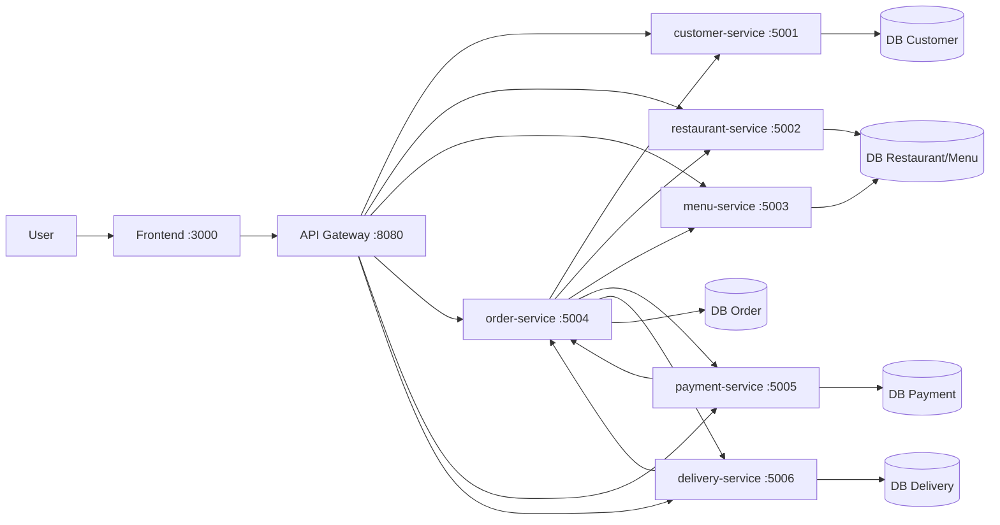
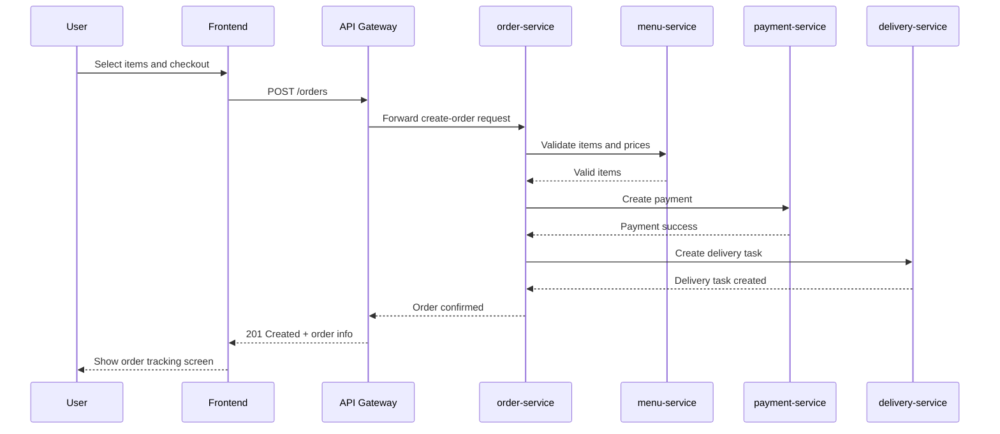

# System Architecture

## 1. Overview

This project implements a **Food Ordering System** using microservices.

- Problem solved: support end-to-end food ordering from browsing menu to payment and delivery tracking.
- Target users: customer, restaurant staff/owner, delivery staff, admin (optional).
- Key quality attributes:
  - Scalability: each service can scale independently.
  - Maintainability: clear bounded contexts and service ownership.
  - Reliability: service isolation limits blast radius when one service fails.
  - Security: all client traffic passes through API Gateway for centralized auth and validation.

## 2. Architecture Style

Applied patterns:

- [x] Microservices
- [x] API Gateway pattern
- [ ] Event-driven / Message queue (planned for Phase 2+)
- [ ] CQRS / Event Sourcing
- [x] Database per service
- [ ] Saga pattern (manual orchestration in service layer for MVP)

## 3. System Components

| Component | Responsibility | Tech Stack (proposed) | Port |
|---|---|---|---|
| Frontend | Customer UI and restaurant dashboard | React/Vue | 3000 |
| API Gateway | Routing, auth, request validation, CORS | Nginx/Express/Spring Cloud Gateway | 8080 |
| customer-service | User profile, address book, account data | Node.js/Spring Boot | 5001 |
| restaurant-service | Restaurant profile, open/close status | Node.js/Spring Boot | 5002 |
| menu-service | Menu categories/items/prices/availability | Node.js/Spring Boot | 5003 |
| order-service | Cart/order creation, order lifecycle | Node.js/Spring Boot | 5004 |
| payment-service | Payment initiation, status updates (COD/mock online) | Node.js/Spring Boot | 5005 |
| delivery-service | Delivery task creation, shipment status tracking | Node.js/Spring Boot | 5006 |
| db-customer | Customer data storage | PostgreSQL/MySQL | 5432 |
| db-restaurant-menu | Restaurant and menu storage | PostgreSQL/MySQL | 5433 |
| db-order | Order and order-items storage | PostgreSQL/MySQL | 5434 |
| db-payment | Payment transaction storage | PostgreSQL/MySQL | 5435 |
| db-delivery | Delivery tracking storage | PostgreSQL/MySQL | 5436 |

## 4. Communication Patterns

- Client-facing communication:
  - Frontend -> Gateway via REST/HTTP.
  - Gateway -> backend services via REST/HTTP.
- Internal communication (MVP):
  - `order-service` calls `menu-service` for price/availability check.
  - `order-service` calls `payment-service` to create/check payment.
  - `order-service` calls `delivery-service` to create delivery task after successful payment/confirmation.
- Service discovery:
  - Docker Compose DNS (`customer-service`, `order-service`, etc.), no hardcoded localhost between containers.

### Inter-service Communication Matrix

| From -> To | Gateway | customer-service | restaurant-service | menu-service | order-service | payment-service | delivery-service |
|---|---|---|---|---|---|---|---|
| Frontend | REST |  |  |  |  |  |  |
| Gateway |  | REST | REST | REST | REST | REST | REST |
| order-service |  | REST (read customer address) | REST (restaurant status) | REST (item/price validation) |  | REST (create payment) | REST (create shipment) |
| payment-service |  |  |  |  | REST (update order payment status) |  |  |
| delivery-service |  |  |  |  | REST (update order delivery status) |  |  |

## 5. Data Flow (Place Order)

Main happy-path request flow:

1. Customer selects items from restaurant menu in frontend.
2. Frontend sends `POST /orders` to Gateway.
3. Gateway forwards to `order-service`.
4. `order-service` validates menu items with `menu-service`.
5. `order-service` creates order with status `PENDING_PAYMENT`.
6. `order-service` requests payment from `payment-service`.
7. On payment success, `order-service` updates order to `CONFIRMED`.
8. `order-service` creates delivery request in `delivery-service`.
9. Delivery status updates are pushed back to `order-service` until `COMPLETED`.

## 6. Architecture Diagrams

### 6.1 Container Diagram

### 6.2 Sequence Diagram - Place Order

## 7. Deployment

- All components run as Docker containers.
- Orchestration by `docker compose`.
- Single startup command: `docker compose up --build`.
- Internal networking via Compose network and service DNS.

## 8. Scalability and Fault Tolerance

- Independent scaling:
  - Increase replicas for read-heavy services (`menu-service`, `restaurant-service`) first.
- Fault isolation:
  - If `delivery-service` is down, order creation can still finish at `CONFIRMED` and retry delivery assignment later.
- Resilience controls (MVP recommendation):
  - Request timeout and retry (limited attempts) for inter-service calls.
  - Idempotency key for payment/order creation endpoints.
  - Circuit breaker can be added in Phase 3+.
- Data consistency:
  - Each service owns its database.
  - Cross-service consistency is eventually consistent through status synchronization APIs.
